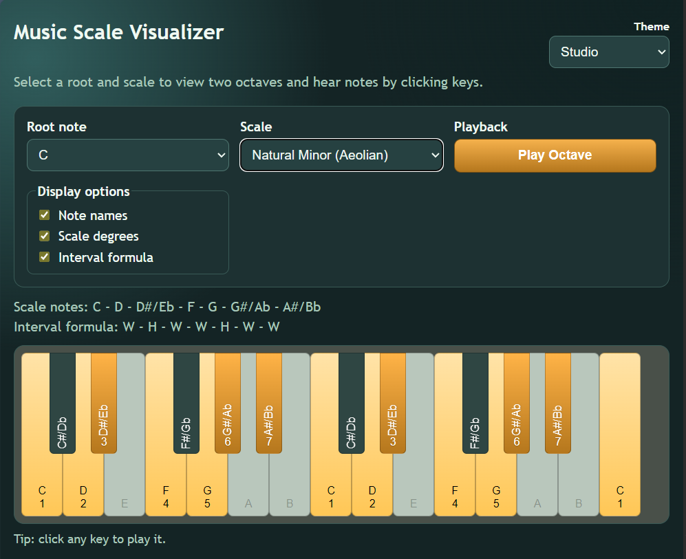

# Music Scale Visualizer

A single-page web application built with vanilla HTML, CSS, and JavaScript for exploring musical scales on a two-octave piano keyboard.

## Features

- Select a root note with enharmonic names (for example, `C#/Db`)
- Choose from a broad set of common scales and modes
- Two-octave keyboard visualization starting from the selected root
- In-scale vs out-of-scale key highlighting
- Black keys rendered in realistic piano layout and height
- Clickable in-scale keys with synthesized piano-like sound
- `Play Octave` button to play one octave of the selected scale
- Synchronized key highlighting during scale playback
- Display toggles for:
  - Note names
  - Scale degrees
  - Interval formula
- Theme selector (`Dark`, `Light`, `Studio`) with dark default

## Scales Included

- Major (Ionian)
- Natural Minor (Aeolian)
- Harmonic Minor
- Melodic Minor
- Dorian
- Phrygian
- Lydian
- Mixolydian
- Locrian
- Major Pentatonic
- Minor Pentatonic
- Blues
- Whole Tone
- Chromatic
- Harmonic Major
- Phrygian Dominant
- Octatonic (Whole-Half)
- Octatonic (Half-Whole)

## Project Structure

- `index.html` - App markup and controls
- `styles.css` - Theme and layout styling
- `app.js` - Scale logic, keyboard rendering, and audio playback

## Running Locally

No build tools or dependencies are required.

1. Open `index.html` in a modern browser.
2. Select a root note and scale.
3. Click in-scale keys or use `Play Octave`.

Note: Browsers require user interaction before audio playback is allowed.

## Customization Notes

- Add or edit scales in `SCALES` in `app.js`.
- Modify theme palettes in CSS under `:root[data-theme="..."]`.
- Tweak playback behavior in `playFrequency()` and `playScaleOctave()` in `app.js`.

## License

No license specified.
